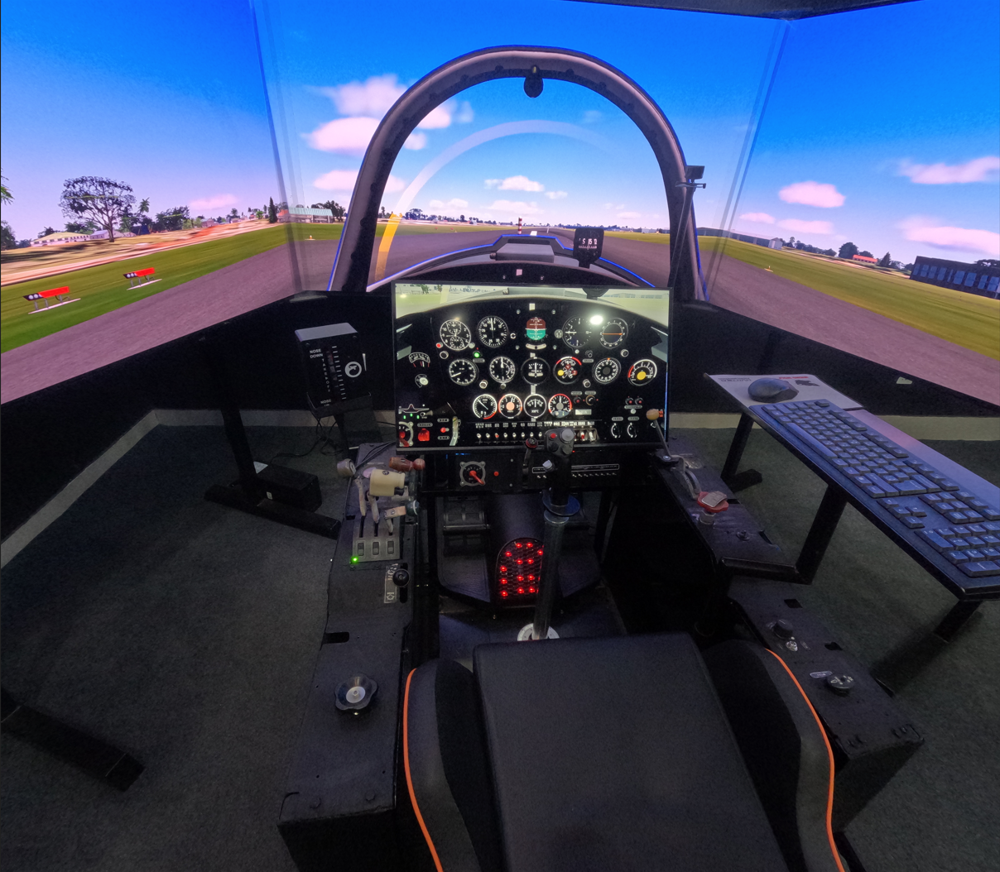
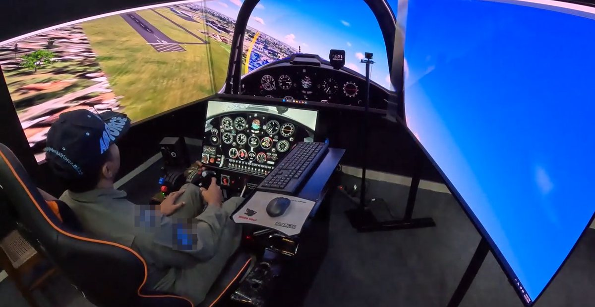
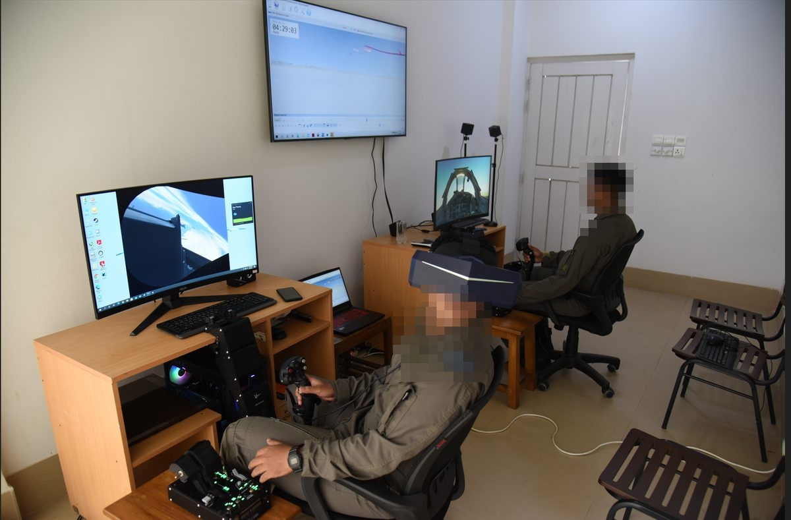
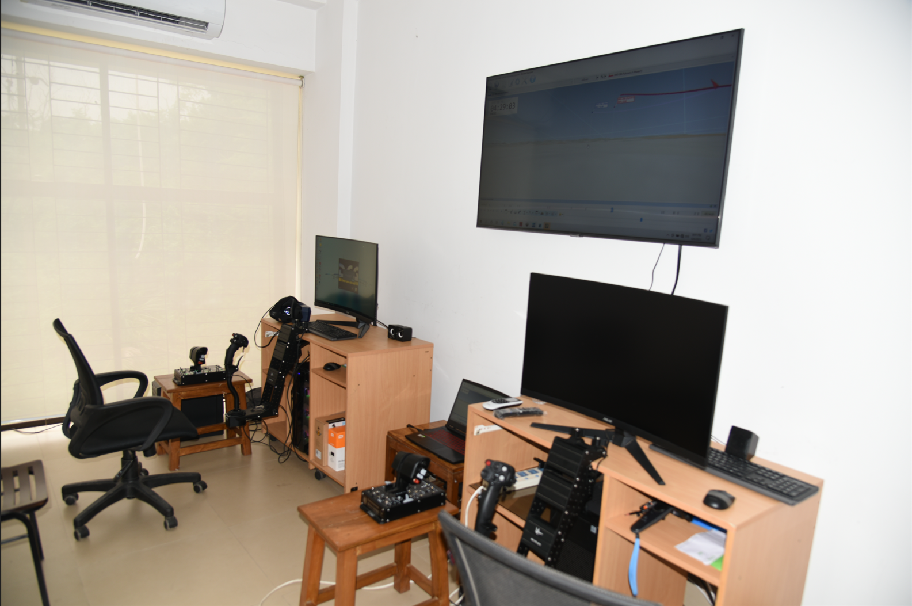
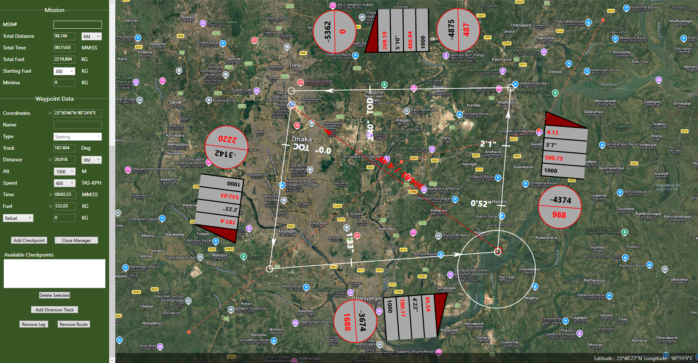
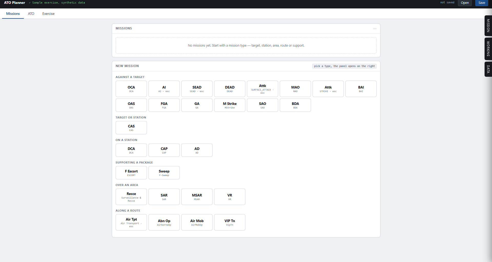
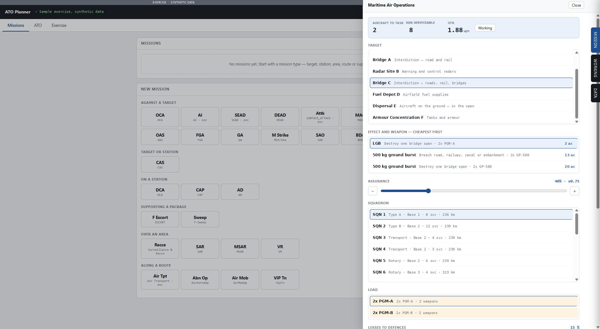

# Abu Jehad Arafat

Dhaka, Bangladesh · [aaaraafaat@outlook.com](mailto:aaaraafaat@outlook.com) · [LinkedIn](https://linkedin.com/in/aaaraafaat) · [CV (PDF)](cv/Arafat_CV_Academic_2026.pdf)

MSc in Data Science and Machine Learning, Flying instructor and former fighter pilot. Finishing an

---

## MSc thesis

### Perception-Difficulty Estimation in Degraded Visual Environments
*In progress. Defence September 2026.*

Predicting per-image object-detection difficulty in fog and low light from physics-based image cues, without training and without an enhancement step.

- Cues: dark-channel prior, saturation, contrast, entropy, among others
- Feature-extraction and cleaning pipeline on RTTS, 4,322 images
- Focus is on where each cue fails, including night scenes and coloured light

<!-- ONE QUANTITATIVE RESULT GOES HERE, then delete this comment. -->

Python · PyTorch · Ultralytics/YOLO · OpenCV · pandas · scikit-learn

[Code and figures](https://github.com/aaaraafaat/perception-difficulty-dve)

---

## Projects

Training and simulation systems built for the Air Force.

### PC-based aviation training device

<table>
  <tr>
    <td width="30%" align="center"></td>
    <td width="50%" align="center"></td>
  </tr>
</table>

2024–2025. COTS hardware with Prepar3D and MSFS and a custom fixed-wing model, for ab-initio and part-task training. Project lead.

### VR combat simulator

<table>
  <tr>
    <td width="50%" align="center"></td>
    <td width="50%" align="center"></td>
  </tr>
</table>

2018. Delivered the concept for a VR part-task trainer, and later consulted on the build of a VR-based PCATD for combat training.

### Flying operations scheduling and progress monitoring (Rule based Auto Rostering and Execution Flow)

<table>
  <tr>
    <td width="33%" align="center"></td>
    <td width="33%" align="center"></td>
    <td width="33%" align="center"></td>
  </tr>
</table>

2025–2026. Web app that builds daily flying schedules against aircraft, instructor and trainee constraints, and tracks trainees through the syllabus.

### Flight planning tool (Navigation)

<table>
  <tr>
    <td width="50%" align="center"></td>
    <td width="50%"></td>
  </tr>
</table>

2019. Google Maps API with layered custom charts, for preparing mission route and navigation charts. I was project manager & UI designer.

### Wargame mission planning platform for Air Force Assets and Threats

<table>
  <tr>
    <td width="50%" align="center"></td>
    <td width="50%" align="center"></td>
  </tr>
</table>

2026. Web application for planning air missions in an exercise setting. Targets and mission types are selected from a data set, weapon and effect options are ranked by the number of aircraft each would cost, and aircraft to task is computed against squadron serviceability, assurance level and expected losses to defences. Made with Claude.
---
All images and screenshots on this page are of my own work and use synthetic or illustrative data. Nothing here represents the position of any other organisation.

## Tools

`Python` · `PyTorch` · `OpenCV` · `pandas` · `scikit-learn` · `Ultralytics / YOLO` · `Git` · `LaTeX` · `Prepar3D / MSFS`

